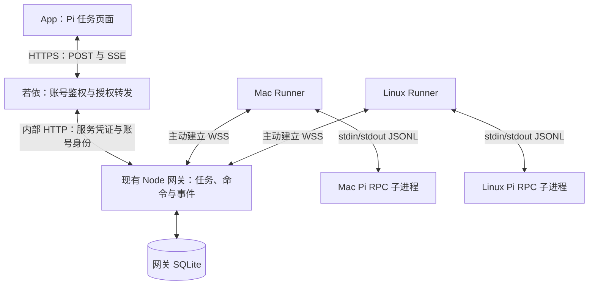

# App 统一操作 Mac 与服务器 Pi 的实现方案

日期：2026-09-22  
状态：2026-09-22 已修复并发布 Android 0.17.10，生产 Java/Node 网关已部署；62 项自动测试通过，Pi 连续对话和紧凑输入区已上线；用户明确批准的云服务器 root 管理入口已部署并通过真实 Pi 操作验收，真实 Mac/Linux Pi 写文件通过。两台正式机器已绑定 admin 并配置自启，安卓真机及登录后的 Java SSE 全链路验收尚未完成；详见 [验收报告](PI_REMOTE_ACCEPTANCE_REPORT.md)。

## 1. 交付目标与范围

用户在现有 App 中选择机器和项目，向该机器上的 Pi 发任务，查看文字、工具执行和文件修改，追加要求、停止执行并恢复历史会话。关闭 App 不影响执行；App 或 Runner 重新连接后能够恢复状态和输出。

第一版支持个人账号下的一台 Mac 和一台 Linux 服务器，采用同一份 Runner 程序。每个任务绑定一台机器、一个项目和一个 Pi 会话，创建后不自动更换执行位置。服务器上的代码与 Mac 上的代码分别保留在各自机器，不自动同步。

交付范围：机器配对与撤销、项目选择、新建与继续任务、流式输出、工具卡片、中途调整要求、追加任务排队、停止、模型选择、历史会话恢复、断线重连、服务常驻。

后续范围：终端 TUI 与 App 同时控制同一进程、跨机器迁移、自动 worktree 并行、完整终端模拟器、Git 提交/推送面板、完整会话分支树、系统推送通知。第一版采用原生 App 页面与 Pi RPC；没有指定具体 pi-web 仓库，不绑定某个 pi-web 的私有协议。

## 2. 已核对的代码与设计依据

以下为当前工作区的静态核对结果，尚未连接用户服务器或测试两台机器上实际安装的 Pi。

| Evidence：现有代码 | Finding：结论 | Path：实施落点 |
| --- | --- | --- |
| `apps/mobile/src/pages/ChatPage.tsx` 调用 `streamAiChat`；`apps/mobile/src/lib/aiApi.ts` 使用 `/ai/chat/stream` | App 当前主聊天走若依，不能仅修改 Node 网关就完成接入 | 新增 Pi 任务入口与独立客户端接口 |
| `RuoYi-Vue-Plus/ruoyi-modules/ruoyi-ai/src/main/java/org/dromara/ai/service/impl/AiChatServiceImpl.java` 使用 `LoginHelper.getUserId()` | 账号身份由若依提供 | 新增受登录保护的 Pi 接口，由服务端获取用户身份 |
| `apps/server/src/db/index.ts` 已有 SQLite WAL、`runs`、`run_events`；`apps/server/src/app.ts` 有 SSE 和 `after` 游标 | 已有任务事件存储经验，但旧任务依赖设备身份和查票逻辑 | 复用 SQLite 连接与事件传输模式，新增 Pi 数据表及路由 |
| `apps/server/src/app.ts` 的 `authenticate` 校验自有设备 token | 网关设备凭证与若依账号凭证不能直接互换 | 若依向内部 Pi 接口转发已验证的用户身份 |
| `packages/agent-runtime/package.json` 固定 Pi 依赖 `0.84.2`；当前 `index.ts` 执行的是查票规划与 LLM 请求 | 安装了 Pi 包不等于已经控制了 Pi 进程 | 独立 Runner 启动目标机器上的 Pi CLI |
| 本地 Pi `0.84.2` 的 `docs/rpc.md` 和 `dist/modes/rpc/rpc-mode.js` | 有 JSONL RPC、`agent_settled`、会话恢复与工具事件；文档没有 `clear_queue` 命令 | 固定基线验证，不能无条件调用最新版才有的命令 |

从仓库根目录复核主要证据：

```bash
rg -n 'streamAiChat|/ai/chat/stream' apps/mobile/src/pages/ChatPage.tsx apps/mobile/src/lib/aiApi.ts
rg -n 'LoginHelper.getUserId' RuoYi-Vue-Plus/ruoyi-modules/ruoyi-ai/src/main/java/org/dromara/ai/service/impl/AiChatServiceImpl.java
rg -n 'run_events|client_request_id|token_hash' apps/server/src/db/index.ts
rg -n 'agent_settled|clear_queue|switch_session' packages/agent-runtime/node_modules/@earendil-works/pi-coding-agent/docs/rpc.md
```

最后一条需要先安装工作区依赖。外部协议参考：[Pi 官方 RPC 文档](https://pi.dev/docs/latest/rpc)。线上最新版与本地固定版本可能不同，实现以通过兼容性检查的版本为准。

## 3. 总体架构与数据归属



| 模块 | 职责 | 持久化归属 |
| --- | --- | --- |
| App | 展示机器、项目、任务、输出；发送用户操作 | 本地只缓存列表、输入草稿和事件游标 |
| 若依 | 验证账号与权限；转发 Pi 请求及 SSE | 使用现有账号系统；第一版不重复存 Pi 任务 |
| Node 网关 | Runner 配对、路由、任务索引、命令记录、事件回放 | SQLite 是 App 任务视图的唯一服务端来源 |
| Runner | 项目校验、Pi 进程管理、指令去重、排队、断线输出补传 | 本机 SQLite 保存执行状态、命令日志与事件 outbox |
| Pi | 模型调用、工具执行、原生上下文与会话 | 原生会话文件与代码保留在执行机器 |

若依与网关在同一服务器时，内部 Pi 接口仅绑定回环地址或容器私网。反向代理仅公开若依 App 接口、Runner 配对兑换和 Runner WSS 接口，不公开内部身份转发接口。

Node 网关第一版保持单实例；不增加 Redis、消息队列或分布式调度。需要多实例时再迁移持久化与连接路由。

## 4. 用户操作与 App 页面

在现有主界面增加“Pi 任务”入口，进入任务列表，按机器筛选。新建任务时依次选择机器、项目、模型并填写要求。详情页头部固定显示机器名称、项目名称和连接状态。

| 操作 | 用户看到的行为 | 实现要求 |
| --- | --- | --- |
| 新建任务 | 选择机器、项目、模型，输入要求 | 创建任务后提交首次执行；机器离线时不自动排到另一台 |
| 继续对话 | 在原任务上下文中继续 | 空闲时创建新的 run，加载原 Pi 会话 |
| 中途调整 | “当前任务改为……” | `steer` 进入当前 run，不创建第二个并发 run |
| 排队追加 | “完成后再……” | Runner 持久化队列，当前 run 结束后创建/启动对应的独立 run |
| 停止 | 显示“停止中”，随后显示确认结果 | 清理 Runner 待执行队列、停止 Pi，并验证没有继续运行 |
| 查看工具 | 折叠显示工具名、参数摘要、执行结果 | 按 `toolCallId` 更新；大输出截断并可分页读取 |
| 修改模型 | 从执行机器支持的模型中选择 | 空闲时执行；运行期间返回冲突，不暗中切换 |
| 恢复历史 | 从目标项目的历史会话列表选择 | 机器在线，Runner 校验会话与项目关系后加载 |
| 归档任务 | 从默认列表隐藏 | 只允许归档空闲任务；不删除代码与原生会话 |

第一版“文件修改”展示 Pi 编辑工具的路径、参数与结果；这不等于完整 Git diff。若需查看差异，单独提供固定的只读 Git 查询，不能从工具输出伪造出“完整修改列表”。

基础可访问性：机器状态使用文字而非仅颜色；图标按钮有可读名称；可键盘操作；不要逐 token 播报辅助阅读提示。

## 5. 最小数据结构

四个业务对象为机器、项目、任务、执行记录；命令和事件表负责可靠传输。所有 ID 使用随机 UUID，不用时间戳拼接。

### 5.1 网关 SQLite

| 表 | 核心字段 | 约束与用途 |
| --- | --- | --- |
| `pi_hosts` | `id, owner_user_id, tenant_id, name, platform, pi_version, capabilities_json, credential_hash, credential_version, expires_at, last_seen_at, revoked_at` | 机器归属与凭证；在线状态由有效连接和心跳派生 |
| `pi_projects` | `id, host_id, runner_project_key, name, display_path, enabled` | `UNIQUE(host_id, runner_project_key)`；路径仅展示，不作为执行授权依据 |
| `pi_tasks` | `id, project_id, title, session_ref, model_json, messages_snapshot_json, snapshot_cursors_json, archived_at, created_at, updated_at` | `session_ref` 为 Runner 返回的不透明标识；快照游标按 run 记录；归属沿项目追溯到机器 |
| `pi_runs` | `id, task_id, status, activity, outcome_json, created_at, started_at, finished_at` | `activity` 表示生成、工具执行或等待输入；非终态不能靠心跳自动改失败 |
| `pi_commands` | `id, owner_user_id, tenant_id, client_request_id, request_hash, task_id, run_id, kind, payload_json, status, response_json, created_at` | `UNIQUE(tenant_id, owner_user_id, client_request_id)`；同 ID 不同请求体返回 409 |
| `pi_events` | `run_id, seq, type, payload_json, occurred_at` | `PRIMARY KEY(run_id, seq)`；先提交数据库，再发布 SSE 和确认 Runner |
| `pi_pairing_codes` | `code_hash, owner_user_id, tenant_id, expires_at, consumed_at` | 配对码带账号归属；原子兑换，短期有效 |

即使当前关闭多租户，也为 `tenant_id` 写入统一默认值并参与归属校验，不能接受客户端任意指定租户。`session_ref` 在同一机器内不得被两个未归档任务同时管理。

Pi 表使用独立前缀，避免把旧 `runs.device_id` 伪装成若依用户 ID；第一版不迁移旧聊天和查票历史。表结构由增量迁移创建，不修改已发布迁移的含义。

### 5.2 Runner 本机状态

Runner 使用独立的状态目录保存 `runner.sqlite` 与配置。配置和凭证文件权限限制为当前运行用户可读写。

本机数据库至少记录：任务到原生会话路径的映射、run 与项目占用、命令接收和派发状态、待执行队列、未确认事件。可用 `run_state`、`command_journal`、`event_outbox` 三张表实现；会话映射由 `run_state` 按 task 关联持久化，不为每次重连重新生成。

Pi 原生会话是模型上下文来源，网关事件是 App 展示来源。恢复历史时使用 Pi 会话接口加载上下文，不把 App 展示文本拼回去冒充原生会话。

## 6. 身份认证与权限

### 6.1 App 到若依，再到内部网关

1. App 使用现有登录 token 调用 `/api/ai/pi/*`；`/api` 沿用部署代理前缀，Java Controller 路径为 `/ai/pi`。
2. Java 验证登录与 Pi 功能权限，从登录上下文取得用户、租户，忽略请求体中的归属字段。
3. Java 向固定配置的内部网关地址发送服务凭证，并附带 `X-Pi-User-Id`、`X-Pi-Tenant-Id`；这些值由服务端重建，不转发客户端同名头。
4. 网关先验证服务凭证，再按账号过滤机器、项目、任务、命令、事件和输出。未知或不属于用户的资源统一返回 404。
5. 服务凭证只在 Java 和网关配置中存在；不能下发 App，不能写入日志。内部地址不得来自 App 参数。

同机部署依赖内部监听隔离与服务凭证共同防护；跨机器部署内部链路必须启用 TLS。SSE 同样经过若依鉴权代理，Java 按字节流转发，不能先收集完整响应再返回。

### 6.2 Runner 配对

App 请求生成一次性配对码；用户在目标机器运行 Runner 配对命令并输入配对码。网关原子消费配对码，颁发绑定机器与账号的随机长期凭证，服务端只存摘要。兑换接口限速，默认配对码有效期 5 分钟。

Runner 在 WSS 握手的 `Authorization` 请求头中携带凭证；凭证默认 90 天有效，可从 App 撤销并重新配对。网关验证后绑定 `hostId`，不信任消息里自行声明的机器身份。Runner 应使用支持握手自定义请求头的 WebSocket 客户端。

撤销后立即拒绝新连接与新命令，关闭现有连接。在线 Runner 收到撤销指令时停止接受任务并尝试停止受管进程；机器离线时无法保证立即停止，App 必须明确显示此限制。

### 6.3 项目与执行权限

项目通过 Runner 本地配置登记，例如项目键 `assistant-handoff` 对应本机工作区绝对路径。App 只提交项目 ID。Runner 解析 `realpath`、校验配置登记与目录存在性，不接收远程任意 cwd、Pi 可执行文件路径或启动参数。

Runner 以普通用户启动 Pi；Mac 默认使用当前用户已有 Pi 配置，服务器使用配置过 Pi 的专用用户。模型密钥留在执行机器，只上报可选模型元数据。

允许选择的项目目录不是沙箱：Pi 的 shell、扩展仍拥有运行用户的权限。共享服务器应使用专用系统用户与文件权限，要求强隔离时使用容器。Runner 自身密钥不作为 Pi 的环境变量传入，但同 UID 文件访问仍无法靠环境过滤隔离，需在部署说明中如实标注。

## 7. App 接口契约

下列均为待实现接口。对 App 的普通响应沿用若依 `R<T>` 包装；SSE 使用事件原文，不套 `R<T>`。路径按外部 `/api` 前缀示例。

| 方法与路径 | 输入 | 返回/行为 |
| --- | --- | --- |
| `POST /api/ai/pi/pairing-codes` | 无 | 一次性配对码与到期时间 |
| `GET /api/ai/pi/hosts` | 无 | 当前用户的机器和连接状态 |
| `POST /api/ai/pi/hosts/{id}/revoke` | 无 | 撤销机器凭证 |
| `GET /api/ai/pi/hosts/{id}/projects` | 无 | Runner 登记过的项目 |
| `GET /api/ai/pi/projects/{id}/models` | 无 | 目标项目环境可用模型；离线时返回缓存标记 |
| `GET /api/ai/pi/projects/{id}/sessions` | 分页游标 | 目标项目历史会话，返回不透明 `sessionRef` |
| `GET /api/ai/pi/tasks` | `hostId, cursor, limit` | 分页任务列表 |
| `POST /api/ai/pi/tasks` | `projectId, title, sessionRef?` | 创建或导入任务；相同已受管会话返回现有任务 |
| `GET /api/ai/pi/tasks/{id}` | 无 | 任务、近期 run、连接状态与分页历史消息入口 |
| `GET /api/ai/pi/tasks/{id}/messages` | `cursor, limit` | 已缓存的原生消息快照；离线可读并标注更新时间 |
| `POST /api/ai/pi/tasks/{id}/commands` | 见下方例子 | 命令 ID、run ID、接收状态 |
| `GET /api/ai/pi/commands/{id}` | 无 | 命令是否被 Runner 接收/派发/拒绝/处于不确定状态 |
| `GET /api/ai/pi/commands` | `clientRequestId` | 按当前账号的幂等键查询，覆盖首次响应丢失、尚未拿到命令 ID 的情况 |
| `GET /api/ai/pi/runs/{id}/events` | `after, format?` | SSE；`format=json` 提供同一游标的有限分页结果 |
| `GET /api/ai/pi/runs/{id}/outputs/{outputId}` | `cursor, limit` | 分页读取已上传的工具输出；不接受文件路径 |
| `POST /api/ai/pi/tasks/{id}/archive` | 无 | 空闲时归档 |

命令请求示例（协议示例，不是当前可调用接口）：

```json
{
  "clientRequestId": "826f2339-9e2b-46b2-93af-5d4e534cb927",
  "kind": "prompt",
  "payload": {
    "text": "修复登录后会话列表不刷新的问题",
    "provider": "anthropic",
    "modelId": "claude-sonnet-4-20250514"
  }
}
```

模型 ID 仅示范字段形状，实际值必须来自执行端返回的列表。命令类型第一版限制为 `prompt`、`steer`、`follow_up`、`stop`、`set_model`、`input_response`。不开放任意 RPC 透传；`stop` 和 `steer` 必须携带目标 `runId`，避免延迟到达后误作用于下一轮任务。`input_response` 必须携带执行实例和请求 ID。

首次创建任务与后续命令都需要幂等键；创建接口同样接收 `clientRequestId`，复用命令账本记录结果。网关返回 202 只表示指令已持久化，不能在 App 上显示“执行成功”。

错误约定：400 参数错误；401 未登录或凭证过期；403 功能未授权；404 资源不存在或不属于用户；409 项目忙、run 不匹配或幂等冲突；413 输入超限；426 Runner/Pi 协议不兼容；503 机器离线；504 查询执行端状态超时。超时不意味着命令没有执行。

## 8. Runner 通信协议

### 8.1 建连与消息

网关公开 `POST /runner/v1/pair` 与 `GET /runner/v1/connect` WebSocket upgrade。使用 WSS，Runner 主动连接，默认 15 秒心跳，45 秒无心跳显示离线；断线以带随机抖动的指数退避重连，上限 30 秒。

握手后 Runner 发送 `hello`：协议版本、Pi 版本、能力列表、登记项目、当前 run、进程实例 ID、各 run 本地最新事件序号。网关返回 `welcome`：新的连接代号、各 run 已连续持久化的序号、需要核对的未决命令。

同一机器只允许一条有效连接；新连接替换旧连接。网关拒绝旧连接代号上的上报。Runner 本机另加单实例锁，避免两个 Runner 同时控制相同会话。连接替换不直接解除项目占用。

| 消息 | 方向 | 含义 |
| --- | --- | --- |
| `command` | 网关 → Runner | 带 `commandId, taskId, runId, kind, payload` 的操作 |
| `command_ack` | Runner → 网关 | 本机已持久化接收；不表示 Pi 已接受 |
| `command_result` | Runner → 网关 | Pi 接受、拒绝或状态不确定，包含关联命令 ID |
| `event` | Runner → 网关 | 带 `runId, seq, type, occurredAt, payload` 的事件 |
| `event_ack` | 网关 → Runner | 已持久化的连续最大序号 |
| `state` | 双向 | 运行实例、任务状态、会话/模型元数据查询与核对 |
| `ping/pong` | 双向 | 心跳；不改变 run 的执行结果 |

状态查询需有 request ID 和超时，不能与执行命令的成功混为一谈。网关将 session 消息快照与工具输出持久化后才向 App 宣告可离线读取。工具输出拆成 `output.chunk` 事件，payload 带 `outputId, chunkIndex, text, final`，存入 `pi_events`；输出分页接口从该 run 的事件中读取，第一版无需另建对象存储。

### 8.2 命令去重与执行不确定性

1. 网关事务写入命令与 run，再尝试派发。执行命令开始前检查机器在线；检查后掉线则保留已创建命令，不假称未提交。
2. Runner 先写命令日志，返回 `command_ack`。重复 `commandId` 只回已知结果，同 ID 不同内容拒绝。
3. 向 Pi stdin 写入前将命令标为 `dispatching`；收到 Pi 对应 `response` 后记录 `accepted` 或 `rejected`。
4. Runner 在“已写 stdin、尚未记录 response”之间崩溃时，结果标为 `unknown`，恢复后核对会话和进程，不自动重放。任意代码执行无法仅靠网络幂等保证 exactly-once。
5. `received` 且尚未派发的命令可以在本机继续处理；网关重连默认只自动补发只读查询。执行命令先查询 Runner 日志，由明确状态决定是否续传。
6. 离线期间网关尚未送达的执行命令重连后显示“待确认发送”，不突然启动旧请求。用户确认沿用原命令 ID，防止重建成第二次执行。

### 8.3 事件顺序与补传

每个 run 的 `seq` 由 Runner 单调分配，并和本机事件记录一起提交。网关按 `(runId, seq)` 去重；重复序号内容不一致视为协议错误。只确认连续落库的最大序号，存在缺口时请求补传。

App 保存最后应用的连续序号，重连携带 `after`。SSE 的 `id` 使用对应序号；订阅与历史回放之间要补查数据库，避免订阅切换窗口丢事件。使用 `fetch` 带 Authorization 读取 SSE，不把登录 token 放进 URL。

Runner 删除已确认的 outbox 记录，不删除原生 Pi 会话。第一版网关保留全部任务事件；App 消息快照必须附带所覆盖的事件游标，避免快照和增量重复显示。未来清理事件时再引入 `CURSOR_EXPIRED` 与完整快照重置协议。

输入文本默认上限 64 KiB；WSS 单条消息上限 1 MiB。Runner 将大型工具结果拆块上传并生成不透明 `outputId`，App 先显示最多 32 KiB 摘要；明确标记截断，不能静默丢弃结果。单 run 上传输出默认上限 20 MiB，超出部分保留本机并显示未上传说明。

本机未确认 outbox 默认预算 256 MiB。接近上限拒绝新 run；用尽或磁盘写入失败时停止当前受管执行并标记中断，禁止继续执行却丢失日志。网关磁盘告警、备份和事件增长纳入部署检查。

## 9. Pi 进程、会话与执行状态

### 9.1 启动与兼容

Runner 使用 Node `child_process.spawn`，固定可执行文件配置和参数数组，`shell: false`，`cwd` 来自本地项目映射。新任务在启动后读取 `get_state` 保存真实会话 ID；恢复任务只使用本机登记的会话路径。

保留 Pi 原生持久化，不能使用 `--no-session`。stdout 按 LF 切分 JSONL，使用流式 UTF-8 解码并处理半包；stderr 作为诊断日志独立限流。不得自行以 Unicode 分隔符拆行；优先检查已安装 Pi 的 RPC 客户端能否满足外部 CLI 与原始事件需求，不能依赖不导出的内部模块路径。

第一版以工作区 `0.84.2` 为开发基线。Runner 启动时报告实际 CLI 版本，执行只读能力检查；版本不兼容只禁用该机器启动任务，不自动升级用户现有 Pi。启动环境需要显式配置 PATH，避免 launchd/systemd 下找不到 nvm 安装的 Node/Pi。

模型、skills、扩展与模型密钥来自目标机器的 Pi 环境。通过同一个普通用户、明确配置目录和项目 cwd 使用已有环境；不得把服务器模型设置自动覆盖到 Mac。

### 9.2 并发和队列

一个任务同一时间只有一个受管 Pi 进程；同一项目同时只运行一个任务。项目锁以真实目录及 Git common directory 识别重复项目别名，第一版同仓库不同 worktree 也串行。锁只协调 Runner 受管任务，不宣称能限制终端里手动运行的程序。

`steer` 属于当前 run；`follow_up` 在 Runner 命令日志中排队，分配独立 run，等前一 run 正常结束才通过 Pi `prompt` 启动。不要把需要独立 run 的追加任务交给 Pi 内部 `follow_up` 队列，否则一个 `agent_settled` 无法清楚对应多个 App run。

前一 run 失败、中断或等待人工处理时暂停队列；用户选择继续后才启动下一项。停止操作取消当前 run 的 Runner 待执行队列；同一项目的其他任务请求返回 409，不另建隐形项目队列。

### 9.3 状态与事件映射

```text
queued → running → succeeded
   │         ├──→ failed
   │         ├──→ interrupted
   │         └──→ cancelling → cancelled / interrupted
   ├──→ failed
   └──→ cancelled
```

连接状态独立为 `online / offline / reconnecting`，不能覆盖执行状态。`running` 的细分 activity 为 `generating / tool_running / waiting_input / retrying`。succeeded 表示本次 Pi 执行正常结束，是否通过测试、是否实现用户目标仍以输出中的证据为准。

| Pi 输出或系统情况 | App/网关处理 |
| --- | --- |
| `prompt` 的 `response.success=true` | 命令已被接受，不标记 run 成功 |
| `agent_start` | `run.started`，状态 running |
| `message_update`、`message_end` | 增量文字和最终消息，保留原生 message ID |
| `tool_execution_start/update/end` | `tool.started/progress/completed`，关联 toolCallId；最终结果可链接 outputId |
| `agent_end` | 记录输出和重试信息；不能直接结束 App run |
| `agent_settled` | 核对最终消息的错误/终止原因、停止意图和失败事件，再生成唯一 run 终态 |
| 工具调用失败但 Pi 继续恢复 | 展示工具失败；不立即把整个 run 标为失败 |
| `extension_ui_request` | 保存输入请求并显示表单/选择/确认卡片 |
| Pi 提前退出、协议损坏、Runner 重启无法确认旧进程 | interrupted；核实进程退出前保留项目占用 |

原生扩展的选择、确认、文本输入可通过 `input_response` 转回 Pi；请求需绑定 `runId + processInstanceId + requestId`，持久化待响应状态，重连仍可显示。重复或过期回复拒绝。无法呈现的自定义终端 UI 返回明确不支持，不伪造用户确认。

### 9.4 停止必须终止执行

先将 run 置为 cancelling、冻结队列，再发送 Pi `abort`。如果目标版本支持清队列命令，则先清队列；本地 `0.84.2` 没有该 RPC，不能假定 `abort` 已清空所有 steer。

基线版本在收到 abort 回复后关闭该任务的 Pi 进程，等待退出；超时则对 Runner 创建并记录的进程组发送终止信号，必要时强制结束。停止后下次继续从持久化会话重新启动。进程组关闭也需处理工具启动的子进程；自行脱离进程组的后台程序不能仅靠 RPC 保证清理，需容器/cgroup 等部署隔离支持。

只在确认受管执行停止后写 cancelled 并释放项目占用；无法确认则 interrupted，阻止新任务覆盖该项目。停止不回滚已经修改的文件。

## 10. 历史会话接管与故障恢复

历史列表只扫描本机配置允许的 Pi 会话目录，按项目 cwd 过滤，返回不透明 sessionRef。加载前再次校验 `realpath`、目录归属与会话格式，不接受 App 提供的绝对路径。

Runner 拥有的会话遵循单写者锁。终端内已运行的 Pi 不会自动变成 RPC 进程，第一版不能实时附着。用户需先退出终端会话，再选择恢复；Runner 能发现活跃占用时拒绝接管，不能发现时也不能声称已证明空闲。导入流程显示单写者条件，并要求用户确认终端已退出，确认结果随导入命令记录。

| 故障 | 恢复行为 | 不允许的行为 |
| --- | --- | --- |
| App 断网或退后台 | Pi 继续；重连拉状态并按游标补事件 | 断开 SSE 时取消 Pi |
| 网关重启 | Runner 继续；重连核对命令与事件，恢复连接路由 | 直接把全部 running 改 failed |
| Runner 与网关断网 | 本地继续执行和记录；等待输入时暂停等待 | 未确认送达就显示停止成功 |
| Mac 睡眠 | 显示机器离线；唤醒后核对进程与模型连接结果 | 承诺睡眠时还能继续计算 |
| Runner 崩溃/重启 | 使用进程记录核对受管子进程；不能重附 stdio 时结束残留进程、将 run 中断 | 丢弃项目锁后启动第二个 Pi |
| Pi 崩溃 | 保留原生会话与事件，用户显式继续 | 自动重发可能已产生副作用的 prompt |
| 导入会话正在终端使用 | 拒绝或要求先退出并确认 | 与终端并发写原生会话 |
| 凭证过期/撤销 | 拒绝新命令，显示重新配对入口 | 自动降级为未认证连接 |

进程记录至少包含 PID、启动时间、实例随机 ID，避免重启后误杀复用 PID 的无关进程。无法验证身份时要求人工处理，不执行全局 `pkill pi`。

## 11. 代码改动与依赖

| 位置 | 计划改动 |
| --- | --- |
| `packages/contracts/src/pi.ts`（新增）与 `src/index.ts` | Pi 请求、消息、事件的 Zod 校验和导出；不把所有原始 RPC 无限制透传 |
| `apps/server/src/pi.ts`（新增） | Pi 路由、内部身份验证、Runner 连接、命令持久化与事件回放；确有复杂度后再拆文件 |
| `apps/server/src/db/index.ts` 与迁移入口 | 增量创建 Pi 表，复用数据库连接 |
| `apps/server/src/app.ts` | 注册 Pi 模块；避免扩写原有查票 executeRun 分支 |
| `apps/pi-runner/`（新增 workspace） | 配对 CLI、配置加载、WSS、Pi RPC、进程与本机状态管理 |
| `RuoYi-Vue-Plus/ruoyi-modules/ruoyi-ai/.../controller/AiPiController.java`（新增）及对应服务实现 | 登录上下文、固定内部上游、Pi HTTP/SSE 转发与超时控制 |
| `apps/mobile/src/lib/piApi.ts`（新增） | 类型化接口、命令幂等键、SSE 重连 |
| `apps/mobile/src/pages/PiTasksPage.tsx`（新增）与 `App.tsx` | 列表、新建、详情入口；随着实际复杂度拆出工具卡片 |
| `apps/mobile/src/lib/runStream.ts` | 评估复用解析器；新增协议需要的重连/游标逻辑不混入普通聊天 |
| `apps/mobile/src/store.ts` | 机器筛选、任务选择和游标缓存；账号切换时清理 |
| `DEPLOYMENT.md`、Runner 部署模板 | WSS 代理、SSE 禁缓冲、内部网关隔离、launchd/systemd 和备份步骤 |

当前已有 Node、TypeScript、Zod、SQLite、Vitest。WebSocket 服务器和握手带凭证的客户端使用 `ws`；锁文件已有 `ws@8.21.3`，实现时将其声明为直接依赖，不能依赖它恰好被其他包传递安装。不添加 Socket.IO、调度框架或新的 ORM。

## 12. 按闭环实施

| 阶段 | 实施内容 | 进入下一阶段的条件 |
| --- | --- | --- |
| P0：协议实测 | 核对两台机器 CLI 路径/版本；在临时项目验证 prompt、事件、恢复、abort、扩展输入 | 能正确判断正常结束、错误结束与停止；记录支持版本 |
| P1：一台机器闭环 | contracts、增量表、若依鉴权转发、配对、单 Runner、发送与事件；用最小 App 页面操作 | App 登录后可在 Mac 临时项目修改一个文件，退出 App 后仍执行 |
| P2：执行可靠性 | 命令日志、outbox、游标补传、项目锁、重启核对、停止、队列 | 断网与崩溃测试不重复派发副作用，不静默丢事件 |
| P3：双机器与历史 | Linux Runner、机器筛选、模型、历史导入、扩展输入、工具详情 | 同一 App 可分别在 Mac/Linux 执行、继续和停止 |
| P4：部署与验收 | 常驻模板、凭证撤销、代理、备份、真实手机断网/后台测试 | 下表全部通过，更新部署记录和已知限制 |

实现从 P0 开始，先验证真实 Pi 协议，再建设任务页面。方案未要求现在部署或修改两台机器的全局 Pi 安装。

## 13. 验收与测试

复用仓库已有 Vitest；不搭建另一套测试框架。核心测试按完整流程组织，用本地假 RPC 进程制造半包、错误和崩溃，真实 Pi 验证单独使用临时目录，不能在真实项目制造故障。

| 验收场景 | 通过标准 |
| --- | --- |
| Mac/Linux 分别执行 | 指定机器上产生预期文件；另一台机器无变更 |
| 连续对话 | 第二轮能读取上一轮创建的文件并保留原生上下文 |
| App 退出再打开 | 原执行继续；历史与增量不重复、不缺行 |
| 模型重试/压缩 | `agent_end` 不导致提前成功；最终 settled 后正确收尾 |
| 发送请求超时后重试 | 同幂等键只产生一个命令；不同内容返回 409 |
| Runner 在写 stdin 前后崩溃 | 明确区分未派发与 unknown；不自动重复执行 |
| 网关断线后恢复 | 连续 seq 补齐、重复事件去重、事件冲突可观测 |
| 停止带 steer 的执行 | Pi 不再继续、Runner 队列取消、确认退出后释放占用 |
| 长命令与子进程 | 受管进程组结束；隔离能力外的后台进程限制有明确结果 |
| 同项目两个任务 | 第二个被拒绝；不同项目可独立执行 |
| 导入终端历史 | 先退出终端；正确过滤项目并保持单写者 |
| 扩展等待输入后断网 | 重连仍显示请求；旧实例/重复响应被拒绝 |
| 大输出、UTF-8 半包、Unicode 分隔符 | 解析正确；截断有标记；内存和磁盘有上限 |
| 用户越权与伪造身份头 | 无法读写他人机器、任务、事件、输出；App 不能直调内部接口 |
| 配对码并发兑换与撤销 | 只一次兑换成功；撤销后不能重连或提交新任务 |
| 服务器/Mac 重启 | Runner 自动启动；旧执行明确标为中断或已恢复状态，不自动重放 |
| 旧业务回归 | 原账号登录、普通聊天、查票、知识库入口仍可用 |

实现阶段的自动检查入口：

```bash
pnpm typecheck
pnpm test
pnpm --filter @assistant/mobile build
```

Java 新增模块按仓库实际构建环境执行相关 Maven 编译与鉴权集成检查；不把 Node 检查通过当作 Java 验证完成。两台机器与真实手机的验收需要在部署记录中分别注明 Pi 版本、运行用户、测试目录和结果。

## 14. 部署、备份与回退

部署顺序为：备份网关 SQLite → 增量建表与网关升级 → 若依转发接口 → 配置代理 → 部署并配对两台 Runner → 开放 App Pi 入口。功能开关默认关闭，通过 P4 后打开。

网关保存 Pi 任务索引和事件，沿用 SQLite 在线备份；Runner 的本机数据库、Pi 原生会话、项目代码分别备份。备份项目代码不等于备份会话，备份网关也不等于保存了两台机器上的实际工作成果。恢复演练需覆盖网关与 Runner 游标不一致时的核对流程。

回退时先关闭新任务入口，逐台确认当前受管执行已停止，再停止 Runner 和关闭 Pi 路由。机器离线无法停止时保持该机器禁用并记录待处理，不能宣称回退已终止远端执行。保留新增表与会话供恢复，不在回退脚本中删库或删除项目文件。

文档交付检查：已区分现状与计划；已核对工作区协议版本；已定义接口、持久化归属、鉴权、断线与停止语义；已列出分阶段交付和验收。本文编写阶段仅做文档检查，未运行双机器集成测试。
