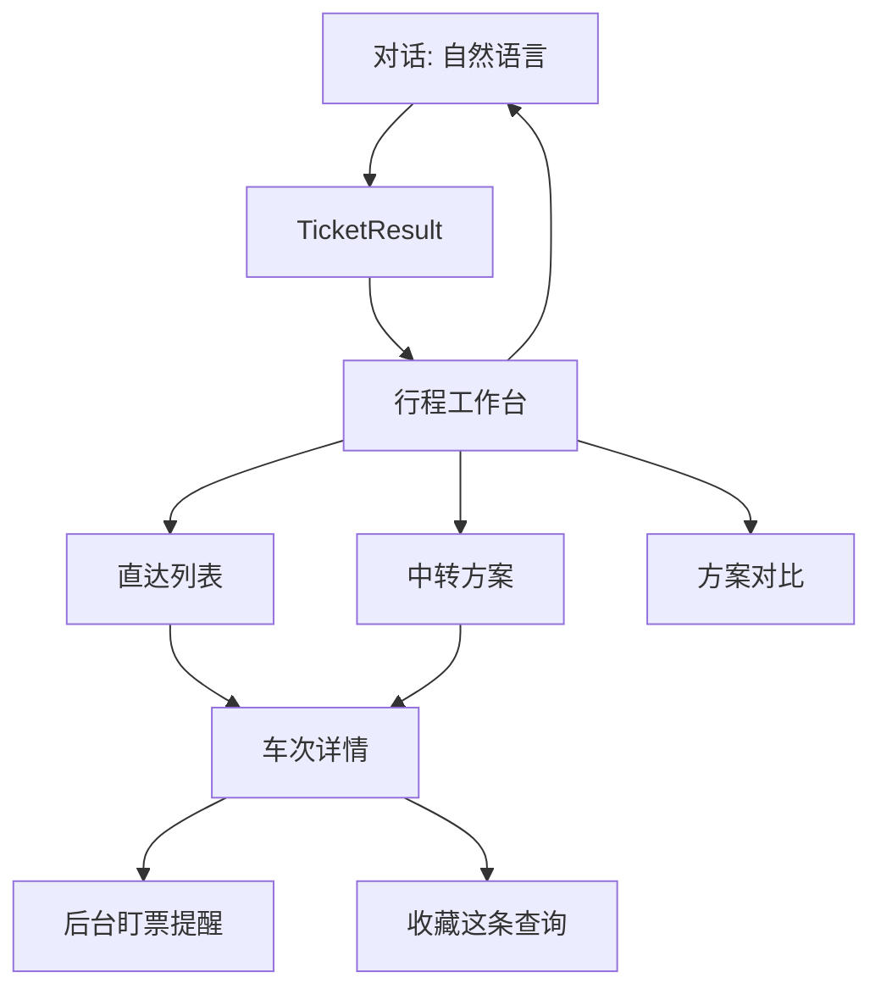

# 智行式信息层设计（不购票）

状态：信息层仍是设计。后台盯票已实现，范围是重查和提醒，不提交 12306 订单。

## 1. 问题

现在查票链路已经能：解析日期/站点、拉 12306 余票、按车型/出发时段/有票/席别过滤、按时长排序、对话里继承条件、中转站二次查询、经停站、收藏查询、未开售时给同星期时刻参考。

呈现仍是对话气泡里的卡片列表（默认 3 张，点开看经停）。智行的价值不在「多一张卡片」，而在用户不用打字就能改条件、比方案、盯一条具体席别。列表、对比、中转仍然只读现有查询结果。

明确不做：

- 下单、占座、支付、候补提交、代替用户向 12306 提交订单
- 编造车次、余票、价格、换乘时间

## 2. 信息架构

对话继续负责「说人话查票」。查到结果后进入独立的**行程工作台**，不再把筛选、对比、换乘堆在气泡里。

工作台顶栏固定四件事，全部绑在当前 `TicketQuery` 上，改任何一个都走已有 `ticket_search`（不经过模型）：

| 控件 | 写入字段 | 行为 |
| --- | --- | --- |
| 日期条 | `query.date` | 今天起 15 天可点；超出预售显示「未开售」，沿用 `planning.mode = schedule_reference` |
| 出发 / 到达 | `query.from` / `query.to` | 城市展开为 `CITY_STATION_MAP` 的站，可勾选子集写入 `selectedStationCodes` |
| 筛选条 | `trainTypes` `departMinutes` `seatPreference` `onlyAvailable` `sort` | 本地先滤已缓存结果；用户点「刷新」才重新请求 |
| 排序 | `sort` 扩展为 `price` | 价格取当前席别偏好的 `priceMinor`，没有则取最低价 |

顶栏下方一条状态：`fetchedAt` + `coverage.status`。`partial` 时列出失败站对，不允许显示成「全部车次」。

## 3. 智行式列表（直达）

一张卡片要在不点开的情况下回答四个问题：几点走、坐多久、哪一档席别最便宜且有票、要不要中转。

现有 `TicketCard` 已有车次、时刻、历时、席别余票、价格、`+N天`、`matchLabels`、时刻参考。补这些只读标记，数据都在单张 `TrainTicket` 里：

- **席别主价格**：按 `seatPreference` 命中的席别；未指定则取有票席别里最低 `priceMinor`。无票席别价格灰色，不作为主价格。
- **余票语义**：`count` 为正显示张数；`available` 且 `count` 为空显示「有」；`waitlist` 显示「候补」但不提供提交；`sold_out` / `unknown` 分开，unknown 不能画成无票。
- **标签**（互斥优先级）：最快（`durationMinutes` 最小）、最早、最晚、最便宜、推荐（沿用 `rankTickets` 的 `matchLabels`）。同一标签只打在第一名。
- **静音车 / 复兴号**：上游没有字段就不显示。禁止用车次号猜测。

列表交互：

- 默认按出发时间，右侧三段排序：出发 / 耗时 / 价格。
- 筛选是横滑胶囊，不是再打开一整页：高铁动车、只看有票、上午、下午、晚上、席别。胶囊状态写回 `TicketQuery`，收藏时原样保存。
- 点卡片进详情，不进经停弹层。经停是详情里的一个页签。

## 4. 车次详情

详情是只读决策页，三块：

1. **行程头**：日期、`trainCode`、出发站时刻、到达站时刻、历时、`dayDiff`。跨日必须标「+1」，不能只显示到达时钟。
2. **席别表**：每种 `Seat` 一行：名称、价格（分→元，保留到角分当 `priceMinor % 100 != 0`）、余票状态。点一行只是「选中用于盯票 / 对比」，不发起购买。选中态存在客户端，不写 12306。
3. **经停**：已有 `RouteModal` 的站序、到发、停留。补两列只读计算：
   - 上车区间高亮：`from.name` 到 `to.name` 之间的站，其余变淡。匹配不到站名时不高亮，并显示「未能在时刻表中定位上下车站」。
   - 区间历时：用本段发车到下车站到达的分钟差；缺时刻则留空，不估算。

底部两条动作：`盯这张席别`、`加入对比`。没有「买票」按钮。

## 5. 中转方案

现状：模型抽出 `via` 后分别查两段，卡片用 `isTransfer` + `transferHub` 标记，文案提示用户自己看两段。这不够用。智行的中转是**一个方案**，不是两张断开的票。

### 5.1 怎么拼，只用查询

不新增上游接口。对每个候选中转站 `H`：

1. 查 `from → H` 与 `H → to`，日期先用同一天。
2. 两段都非空才生成方案。任一段失败，方案标记 `partial`，不显示成可选。
3. 配对规则（确定性，禁止模型编）：
   - 第二段发车 ≥ 第一段到达 + `minTransferMinutes`（默认同站 25，跨站 60）。
   - 第二段若落在次日，`date` 用 `addDays(query.date, dayDiff)` 再查一次；查不到就丢弃这对，不拿当天车次硬接。
   - 每个第一段最多保留后续 3 班，避免组合爆炸。
4. 同站 / 跨站：两端站名字符串相同为同站；否则跨站。没有市内交通数据时，跨站只标「需自行换乘」，不估地铁时间。
5. 方案排序：总历时（含等候）升序，其次总价升序。总价缺任一段则为空，不参与价格排序。

### 5.2 方案卡片

一条方案一张卡，不拆成两张直达卡：

- 上：总历时、总价、换乘次数（现只做 1 次）、同站/跨站、等候分钟。
- 中：时间轴 `出发时刻 站名 → 中转站 等候 → 到达时刻 站名`，两段各标车次。
- 下：两段各自「最便宜有票席别」。任一段无票，整张方案标「有一段无票」，仍可进详情看是哪一段。

详情里两段各自展开第 4 节的席别和经停。用户可以只盯其中一段。

### 5.3 中转站从哪来

优先级：

1. 用户或模型已给的 `via`（现有字段）。
2. 直达为空或全部无票时，用有限枢纽表试探，沿用现有枢纽名（郑州东、石家庄、西安北、济南西、徐州东、南京南、合肥南、武汉、郑州），最多 3 个并发查询。
3. 不根据城市名猜测「所有可能中转」。枢纽表外的站只在用户点名后查。

直达有票时，中转默认折叠在「更多方案」，不抢直达的位置。

## 6. 对比

对比篮最多 3 条，直达和中转方案可以混放。对比表只列查询字段：

| 行 | 来源 |
| --- | --- |
| 出发 / 到达 | `departureAt` / `arrivalAt` |
| 历时 | `durationMinutes` 或方案总历时 |
| 价格 | 选中席别，否则最低有票价 |
| 余票 | 该席别 `availability` + `count` |
| 换乘 | 直达为「无」，中转为等候分钟 + 同站/跨站 |
| 到达日 | `dayDiff` |

不同日期的票可以对比，但表头标出日期，避免把时刻参考和实时余票比成同一天。时刻参考行加「未开售」且不显示余票张数。

## 7. 后台盯票

已实现。盯的是「某车次 + 某席别」。服务端进程活着就会重查，不要求手机停在页面上。发现有票只提醒，不登录 12306，不占座，不支付。

- 无票席别上的「盯票」写入 `ticket_watches`。日期、出发站、到达站和席别取自该卡片。
- 同一设备最多 20 条活动任务。每条间隔至少 60 秒，默认 180 秒。调度器一轮只查一条。
- 重查绕过 30 秒结果缓存，并放宽车型、时段、仅有票过滤，避免目标车次被筛掉。
- 只有上一次是无票、未知或候补，这一次变成有票，才算放票。本来就有票不重复提醒。
- 命中后任务停止。手机每 20 秒拉一次列表，页面可见时出横幅。没有系统推送，应用没打开就看不到。
- 出发日期过了当天（上海时区）标为过期。时刻参考和中转拼票不能盯。候补状态只展示，不生成候补单。

收藏仍是查询条件，不是库存快照。盯票单独存。

## 8. 对话怎么接

工作台不取代对话。模型仍然只负责把自然语言变成 `TicketQuery`（+ 可选 `via`）。下列说法在进入工作台后变成控件操作，模型不用再答一轮：

- 「只看有票 / 二等 / 上午 / 最快 / 最便宜」→ 筛选条
- 「换成后天 / 改成北京南」→ 顶栏
- 「和上一班比一下」→ 对比篮
- 「有票了告诉我」→ 对无票席别创建后台盯票，并说明「有票只提醒，不自动下单；应用打开时才能看到」

模型禁止输出车次时刻和价格。和现在一样，数字只来自卡片。工作台打开时，助手短句只复述 `planning.matchSummary` 和覆盖率，不复述列表。

## 9. 契约增量

不改已有字段含义。追加可选字段，旧客户端忽略即可。

`TicketQuery` 追加：

- `sort` 增加 `'price'`
- `via?: string`（今天 via 只活在 runtime，刷新和收藏会丢）
- `transfer?: { enabled: boolean; minSameStationMinutes: number; minCrossStationMinutes: number }`

新类型 `TransferPlan`（不塞进 `TrainTicket`，避免一张票伪装成两段）：

- `id`, `hub`, `sameStation`, `waitMinutes`, `totalMinutes`, `totalPriceMinor: number | null`
- `legs: [TrainTicket, TrainTicket]`
- `warnings: string[]`（跨站、有一段无票、第二段改日查询）

`TicketResult` 追加可选 `transfers: TransferPlan[]`。直达仍在 `tickets`。

盯票使用 `ticket_watches`，不复用收藏表。字段见 `apps/server/src/services/ticketWatch.ts`。

## 10. 落地顺序

1. **列表决策信息**：主价格、余票语义、最快/最便宜标签、筛选胶囊写回 query。纯本地，风险最低。
2. **详情替代 RouteModal**：席别选择 + 区间高亮经停。仍是一次 `train_route`。
3. **`via` 进 `TicketQuery`**：收藏和刷新不再丢中转站。
4. **`TransferPlan` 拼接**：先只接用户指定的一个 via，枢纽试探放后面。
5. **对比篮**：本地状态，不入库。
6. **后台盯票**：已落地。重查加应用内提醒，无推送，不提交订单。

每步都不打开购票。枢纽自动试探（第 4 步之后）会放大 MCP 调用量，必须沿用现有 `maxStationPairs` 和失败即 `partial`，不能为了「像智行一样总有方案」去打满中转站。
